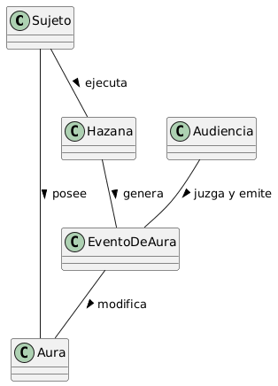

# Escenario 2. Farmear Aura

## Esquema

## Glosario de Términos (en lenguaje de viejos como yo)

- **Alfa**: Individuo (el protagonista) que ejecuta acciones buscando proyectar dominio, superioridad o coolness extrema frente al resto.
- **Looksmaxx**: En vez de hazaña. Es una acción, rutina o táctica (como el mewing)llevada al extremo. Es la herramienta principal para farmear.
- **MomentoSigma**: Instante cumbre de demostración de frialdad, aislamiento voluntario o dominio absoluto (el pico de la hazaña) que altera radicalmente el nivel de aura.
- **Followers**: Testigos presenciales o digitales (espectadores, simps, comunidad) que presencian la acción, validan la actitud y sienten el impacto del momento

Los terminos anteriores han sido adaptados al *lenguaje del cliente*. He usado como referencia a mi hermana menor que sabe más de esto.

## Supuestos Adoptados

Riesgo de Cringe:

- Farmear aura no es gratis. Si la Audiencia percibe que la hazaña requirió mucho esfuerzo o fue actuada/forzada, el EventoDeAura genera un resultado negativo.

Rol de la Audiencia como ente emisor:

- El aura no existe en el aislamiento. Una hazaña a solas no farmea aura a menos que quede registrada para una Audiencia (digital o física) que emita el veredicto.