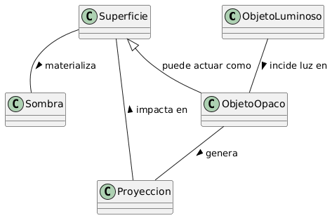

# Escenario 1. Una sombra

## Esquema

## Glosario de Términos

- Sombra: Región de oscuridad o penumbra que se produce en un espacio determinado cuando un objeto interrumpe el paso directo de los rayos de luz.
- Fuente de Luz: Elemento emisor de radiación luminosa (ej. el Sol, una linterna, una vela) necesario para generar la iluminación.
- Objeto Opaco: Cuerpo físico no transparente que se interpone en la trayectoria de la luz bloqueándola parcial o totalmente.
- Superficie de Proyección: Soporte físico o plano (ej. el suelo, una pared, una pantalla) sobre el cual impacta la luz no bloqueada y se visualiza la sombra.
- Silueta: Contorno o figura geométrica bidimensional proyectada, resultado de la deformación lineal del objeto según el ángulo y distancia de la luz.

## Supuestos Adoptados

> Un Objeto Luminoso (Fuente de Luz) es necesario para generar una Sombra. Al obstruir la trayectoria de la luz, el Objeto Opaco crea una Sombra.

Un ejemplo de esto es el Sol (Objeto Luminoso) que proyecta sobre la Tierra (Objeto Opaco) y crea una sombra en ella (la noche). La superficie de proyección también puede el mismo objeto ópaco.

> Autosombra

El concepto anterior introduce la "autosombra" a la consideración del modelo. Cuando la Tierra bloquea al Sol, genera un cono de oscuridad en el espacio (Proyeccion). Ese cono existe aunque no haya una pared atrás. La Sombra solo nace cuando esa proyección choca contra una Superficie. 

El modelo del dominio aun se aplica a las sombras tradicionales como una taza sobre una mesa. Inclusive propone abarcar aún más en el concepto de sombra: *No es solo la proyección sobre la superficie, sino todo el espacio oscurecido por el objeto ópaco.*